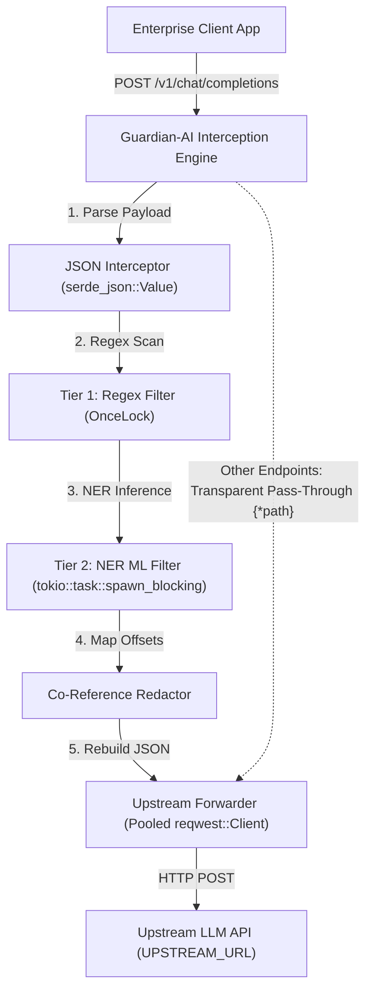

# 🛡️ Guardian-AI (`llm-firewall-rs`)

[](https://www.rust-lang.org/)
[](LICENSE)
[](https://github.com/tokio-rs/axum)
[](https://tokio.rs/)

**Guardian-AI** is a blazing-fast, zero-overhead stateless intercepting filter proxy written in Rust. It sits between enterprise applications and external Large Language Model (LLM) APIs (such as OpenAI, Anthropic, or custom endpoints) to perform stateless, one-way redaction of sensitive data (PII).

By combining high-performance regex scanning with quantized local Machine Learning (NER) models running via Hugging Face's `candle-core`, Guardian-AI ensures that no sensitive personal data ever crosses the enterprise boundary—fully air-gapped and with zero runtime external API dependencies.

---

## ⚡ Key Features

*   **🚀 Zero-Overhead Async Architecture**: Built with [Axum](https://github.com/tokio-rs/axum), [Tokio](https://tokio.rs/), and [Reqwest](https://github.com/seanmonstar/reqwest), featuring transparent pass-through routing, async body streaming, and HTTP connection pooling.
*   **🛡️ Multi-Tier Redaction Engine**:
    *   **Tier 1 (Regex)**: High-speed scanning using pre-compiled, thread-safe patterns for strict formats (US SSNs, Credit Cards, Emails, Phone Numbers, and IP Addresses).
    *   **Tier 2 (ML NER)**: Local, quantized Named Entity Recognition (NER) models (e.g., `dslim/bert-base-NER`) executing CPU-bound inference safely isolated from async worker threads.
*   **🔗 Co-Reference Preserving**: Translates identical PII entities to matching indexed semantic tokens (e.g., `John Doe` -> `[REDACTED_NAME_1]`) consistently across the request, preserving contextual relationships.
*   **🔒 Fail-Closed Policy**: Standard enterprise security posture. Any failure in the parsing, regex evaluation, or ML execution triggers a fail-closed `500 Internal Server Error` to guarantee zero PII leakage.
*   **🔄 Transparent Fallback**: Functions as a drop-in replacement for downstream API wrappers. Only completions payloads (`POST /v1/chat/completions`) are intercepted; all other endpoints are transparently forwarded.

---

## 📐 Design & Network Flow



### Invariants
*   **Stateless Execution**: The proxy maintains no persistent cache or request logs on disk, permitting infinite horizontal scalability.
*   **Single-Pass Text Mutation**: Spans are computed against the original string, resolved for overlaps, offset-adjusted, and replaced in a single final pass to avoid UTF-8 boundary slicing panics.
*   **Host and Connection Re-writing**: Automatic removal of connection-specified hop-by-hop headers, recalculation of mutated payload `Content-Length`, and `Host` rewriting to ensure upstream handshake success.

---

## 📁 Repository Structure

```text
llm-firewall-rs/
├── crates/
│   ├── guardian-core/   # Pure detection engine, regex/ML, co-ref state & token maps
│   ├── guardian-proxy/  # Axum MITM proxy, streaming handlers & upstream client
│   └── guardian-cli/    # CLI entrypoint, argument/env parsing, and server runtime
├── src/
│   └── main.rs          # Root binary forwarder stub calling guardian-cli
├── docs/                # BMAD planning, architecture spines, specs & implementation stories
├── model/               # Local quantized NER model assets (safetensors & tokenizers)
├── scripts/
│   └── setup_model.sh   # Downloads model safetensors and configurations locally
├── AGENTS.md            # Agent guidelines and context hygiene rules
└── Cargo.toml           # Multi-crate Cargo workspace configuration
```

---

## 🛠️ Getting Started

### Prerequisites

*   **Rust Compiler**: `rustc 1.85.0` or newer.
*   **CMake / C Compiler**: Required for compiling Hugging Face `candle` dependencies.

### Environment Variables

| Variable | Description | Default |
| :--- | :--- | :--- |
| `PORT` | Listening port for the proxy server | `3000` |
| `UPSTREAM_URL` | Base URL of the upstream LLM API provider | `https://api.openai.com` |
| `MODEL_DIR` | Local directory containing `.safetensors` model weights | `./model/` |

### Installation & Run

1.  **Clone the Repository**:
    ```bash
    git clone https://github.com/devg24/llm-firewall.git
    cd llm-firewall-rs
    ```

2.  **Download the ML Model Assets**:
    Download the quantized standard NER model assets (e.g. weights and tokenizer config) and save them to the model directory:
    ```bash
    chmod +x scripts/setup_model.sh
    ./scripts/setup_model.sh
    ```

3.  **Build and Run**:
    ```bash
    cargo run --release
    ```

### Running Tests

The test suite covers endpoints validation, port and upstream URL parsing logic, connection hop header stripping, and transparent proxy forwarding:
```bash
cargo test
```

### 🚀 Demo

To see Guardian-AI's redaction in action locally:

1. Make sure you have downloaded the ML model assets and started the server (`cargo run --release`).
2. Open a new terminal and send a test request containing PII (like a phone number and email):

```bash
curl -X POST http://localhost:3000/v1/chat/completions \
  -H "Content-Type: application/json" \
  -H "Authorization: Bearer YOUR_OPENAI_API_KEY" \
  -d '{
    "model": "gpt-3.5-turbo",
    "messages": [
      {
        "role": "user",
        "content": "My name is John Doe and my phone number is 555-123-4567. My email is john.doe@example.com."
      }
    ]
  }'
```
*(Note: If you omit a valid API key, the proxy will still successfully intercept and redact the PII locally before OpenAI returns a `401 Unauthorized`. You can observe the successful redaction in the proxy terminal logs!)*

---

## 🔒 Security Policy

Guardian-AI is built for strict environments:
*   **Fail-Closed**: If any middleware, model runner, or regex evaluator panics or times out, the request is immediately halted with a generic `500 Internal Server Error`.
*   **Zero Retention**: Prompt translations and replacement maps are short-lived stack allocations that disappear as soon as the request completes.

---

## 📄 License

This project is licensed under the MIT License - see the [LICENSE](LICENSE) file for details.
