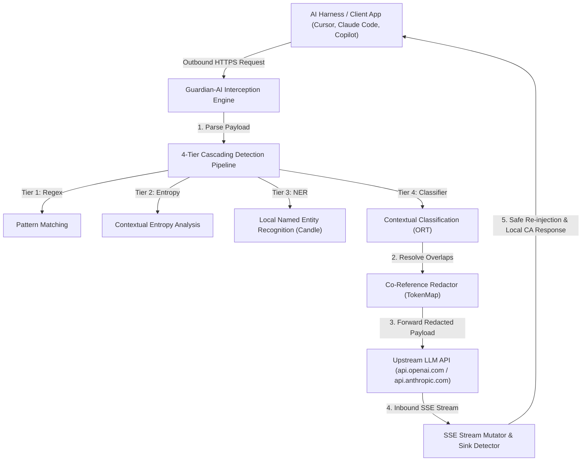

# 🛡️ Guardian-AI (`llm-firewall-rs`)

[](https://www.rust-lang.org/)
[](LICENSE)
[](https://github.com/tokio-rs/axum)
[](https://tokio.rs/)

**Guardian-AI** is a blazing-fast, zero-overhead, bidirectional stateful intercepting filter proxy written in Rust. It sits between AI coding assistants / enterprise applications (such as Claude Code, Cursor, Copilot, or custom LLM clients) and external Large Language Model (LLM) APIs (OpenAI, Anthropic, or custom endpoints).

Guardian-AI provides an air-gapped, zero-leakage guarantee by automatically replacing detected secrets and PII with indexed semantic placeholder tokens outbound, and transparently re-injecting the real values into the inbound LLM response stream.

---

## ⚡ Key Capabilities

*   **🔄 Bidirectional Stateful Proxying**: Transparently intercepts outbound LLM requests, swaps sensitive data with indexed tokens (e.g. `[REDACTED_SECRET_1]`), and re-injects the original values into inbound Server-Sent Events (SSE) streaming responses in real time.
*   **🛡️ 4-Tier Cascading Detection Pipeline**:
    *   **Tier 1 (Pattern Matching)**: Deterministic regex scanning for strict formats (SSNs, Credit Cards, Emails, Phone Numbers, IPs, AWS/GitHub/OAuth tokens).
    *   **Tier 2 (Contextual Entropy)**: Shannon entropy scoring combined with context analysis to catch unknown-format API keys and passwords while suppressing false positives on UUIDs, hashes, and base64 assets.
    *   **Tier 3 (Local ML NER)**: Local BERT Named Entity Recognition using Hugging Face's `candle-core` for context-dependent entity detection.
    *   **Tier 4 (Contextual Classifier)**: ONNX-based (`ort`) ML classifier targeting borderline confidence spans within a tight latency budget.
*   **🛡️ Context-Aware Dangerous Sink Blocking**: Inspects a rolling 512-byte lookbehind buffer on inbound streams to prevent re-injecting secrets into dangerous exfiltration sinks (such as `curl`, `fetch`, `subprocess`, or file writes outside the workspace).
*   **⚡ Zero-Config CLI with Local CA Trust**: `llm-firewall on` automatically generates and installs a local CA certificate into the OS trust store and auto-patches configuration for installed AI tools (Claude Code, Cursor, Copilot) with zero manual config files.
*   **🔍 First-Run Scare Report Scanner**: `llm-firewall scan` silently analyzes local workspaces to uncover potential secret exposures and generate compliance-ready exposure cost reports.
*   **🎯 Domain Profile Auto-Tuning**: Auto-detects project domains (e.g., standard, crypto/fintech, healthcare) by scanning project manifests (`Cargo.toml`, `package.json`), automatically adjusting detection thresholds.
*   **⚙️ Power-User Configuration**: Supports optional repository overrides via `.guardian.toml` with ReDoS pre-validation and graceful fallback to zero-config defaults.
*   **🔒 Fail-Closed Security & Pure Rust Safety**: 100% fail-closed posture across all pipelines with zero `unsafe` Rust.

---

## 📐 Design & Network Flow



---

## 📁 Repository & Workspace Structure

```text
llm-firewall-rs/
├── crates/
│   ├── guardian-core/   # Pure detection engine (4 tiers), domain tuning, TokenMap & redaction
│   ├── guardian-proxy/  # Axum MITM proxy, SSE stream mutator & upstream client
│   └── guardian-cli/    # CLI entrypoint (llm-firewall on/scan/stats/report), CA manager, patcher
├── src/
│   └── main.rs          # Workspace binary entrypoint forwarding to guardian-cli
├── docs/                # BMAD planning, architecture spines, specs & implementation stories
├── model/               # Local quantized NER model assets (safetensors & tokenizers)
├── scripts/
│   └── setup_model.sh   # Downloads local model assets
├── AGENTS.md            # Agent guidelines and context hygiene rules
└── Cargo.toml           # Multi-crate Cargo workspace
```

---

## 🛠️ Getting Started

### Prerequisites

*   **Rust Compiler**: `rustc 1.85.0` or newer.
*   **CMake / C Compiler**: Required for compiling `candle` and `ort` dependencies.

### Installation & Run

1.  **Clone the Repository**:
    ```bash
    git clone https://github.com/devg24/llm-firewall.git
    cd llm-firewall-rs
    ```

2.  **Download ML Model Assets**:
    ```bash
    chmod +x scripts/setup_model.sh
    ./scripts/setup_model.sh
    ```

3.  **Run the CLI**:
    ```bash
    # Scan current repository for exposed secrets (First-run scare report)
    cargo run -- scan

    # Start the bidirectional proxy and auto-patch installed AI harnesses
    cargo run -- on

    # Run standalone proxy server
    cargo run -- proxy --port 3000 --upstream https://api.openai.com
    ```

### Running Tests

```bash
cargo test --workspace
```

---

## 🔒 Security Policy

*   **Fail-Closed**: If any middleware, model runner, or regex evaluator panics or times out, the request is immediately halted with a generic `500 Internal Server Error`.
*   **Zero Retention**: Prompt translations and replacement maps are short-lived request-scoped state that disappear as soon as the request completes.
*   **Sink Quarantine**: Any prompt-injected attempt by an LLM to output secrets into executable or exfiltration contexts is quarantined.

---

## 📄 License

This project is licensed under the MIT License - see the [LICENSE](LICENSE) file for details.

