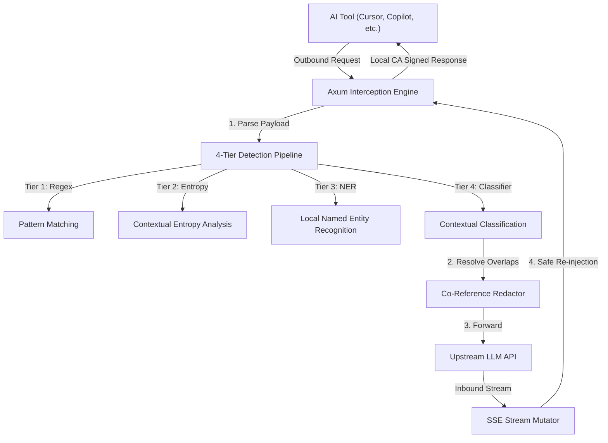

# Guardian-AI (`llm-firewall-rs`) Project Deep Dive

## 1. Problem Statement
Enterprise applications and individual developers increasingly rely on external Large Language Models (LLMs) such as OpenAI and Anthropic, often via tools like Claude Code, Cursor, or Copilot. This integration introduces significant data privacy and security risks—primarily the inadvertent exposure of sensitive Personally Identifiable Information (PII), proprietary source code, or secrets to third-party endpoints. Developers are often locked out of using AI on sensitive work (NDA repos, pre-launch code) due to data exfiltration risks. They need an air-gapped, zero-leakage guarantee that sensitive data never crosses their network boundary, without modifying every downstream client application.

## 2. Value Proposition
Guardian-AI (v2 Elevation) acts as a transparent, high-performance, bidirectional stateful intercepting filter proxy. It sits between internal applications/AI coding assistants and external LLM APIs to provide:
- **Zero PII & Secret Leakage:** Completely sanitizes sensitive data on the fly before it leaves the developer's machine or enterprise network.
- **Fearless AI Pairing:** Enables developers to use AI coding assistants on any repository without risking data exfiltration. Acts as a drop-in replacement with zero-config auto-detection for popular tools.
- **Context Preservation & Bidirectional Injection:** Employs co-reference resolution (e.g., mapping `John Doe` to `[REDACTED_NAME_1]`) consistently across requests. Crucially, it intercepts LLM-generated output and re-injects the real values inbound, so the AI harness operates identically to an unproxied session.
- **Fail-Closed Security:** Adheres to enterprise security standards by instantly halting and returning a `500 Internal Server Error` if any internal pipeline fails, guaranteeing no unverified data escapes.
- **First-Run Scare Report:** Quickly scans local repos to demonstrate exposure risks, generating compliance-ready session audits and stats.

## 3. Architecture Overview
The system employs a 4-tier cascading pipeline intercepting outbound `POST /v1/chat/completions` traffic, paired with context-aware inbound streaming.

1. **Bidirectional Proxy Layer:** Axum server handles local CA certificate generation, transparently intercepts HTTPS traffic, and parses JSON payloads.
2. **Tier 1 (Regex):** Pre-compiled, highly optimized regex patterns perform a first-pass scan for strict formats like SSNs, Credit Cards, Emails, and IPs.
3. **Tier 2 (Entropy):** Contextual entropy analysis catches high-entropy strings (e.g., unknown API keys) while suppressing false positives (UUIDs, base64 images).
4. **Tier 3 (ML NER):** Local Named Entity Recognition models (e.g., `dslim/bert-base-NER`) via Hugging Face Candle to detect complex entities.
5. **Tier 4 (Classification):** Edge-case refinement utilizing ONNX-based (`ort`) machine learning models executing strictly on borderline spans (10-25ms budget).
6. **Co-Reference Redaction & Re-injection:** Spans are mapped to index tokens (`[REDACTED_TYPE_N]`) and stored in a request-scoped state. During the SSE inbound stream, the `StreamMutator` safely re-injects real values into the LLM's response.
7. **Context-Aware Output Scanning:** The mutator analyzes a rolling lookbehind buffer to prevent re-injecting secrets into dangerous sinks (like `curl` commands or out-of-repo file writes).

## 4. Technical Techniques & Implementation Details
- **Zero-Overhead Async I/O & Streaming:** Uses Tokio and Axum for non-blocking HTTP processing. High-level async stream combinators (`async-stream`) handle inbound SSE mutation without frame corruption.
- **Request-Scoped Paired State:** The translation map (`TokenMap`) is instantiated per outbound request, wrapped in an `Arc`, and shared exclusively with that request's inbound streaming task to avoid memory leaks or global state complexities.
- **CPU-Bound Task Isolation:** Machine learning inference (Candle, ort) is strictly offloaded to `tokio::task::spawn_blocking` to prevent starving the Axum async worker threads.
- **Single-Pass Text Mutation:** Identified redaction spans are collected, resolved for overlaps across all 4 tiers, and applied in a single backward pass to prevent UTF-8 boundary slicing panics.
- **Domain Profile Auto-Detection:** Automatically scans `Cargo.toml`, `package.json`, etc., to adjust per-tier confidence thresholds (e.g., tuning for a crypto project versus a healthcare project) to reduce false positives.
- **Power-User Configuration:** Supports overrides via a `.guardian.toml` file, while safely falling back to defaults if parsing fails.

## 5. Exact Tech Stack
- **Language:** Rust (v1.85.0, Edition 2021)
- **Async Runtime:** Tokio (v1.52.3)
- **Web Framework:** Axum (v0.8.9)
- **HTTP Client:** Reqwest (v0.13.4, with connection pooling)
- **Machine Learning / Inference:** `ort` 2.0 (Tier 4 ONNX) and Hugging Face Candle (`candle-core`, `candle-nn`, `candle-transformers` v0.10.2 for Tier 3 BERT NER)
- **Serialization:** Serde & Serde_json (v1.0)
- **Text Processing:** `regex` (v1.12.4), `tokenizers` (v0.22.2), `aho-corasick` (v1.1.3)
- **Async Streams:** `async-stream` (v0.3.5)
- **CLI Framework:** `clap` (v4.5.4)
- **Observability:** `tracing` & `tracing-subscriber`

## 6. Key Metrics & Outcomes
- **Detection Accuracy:** Target F1 score ≥ 0.95 across golden datasets containing mixed secret types. Catches ≥ 90% of unknown-format API keys while suppressing ≥ 95% of safe high-entropy strings.
- **Security SLA:** 100% Fail-Closed rate upon pipeline disruption; zero unauthorized PII transmission. Lookbehind buffer catches malicious prompt injection exfiltrations.
- **Latency:** Sub-millisecond p99 latency per interception on the proxy hot path. Tier 4 classifier executes only on borderline confidence spans.
- **Robustness:** Strict enforcement of async safety invariants (e.g., zero `std::sync::Mutex` locks held across `.await` points).
